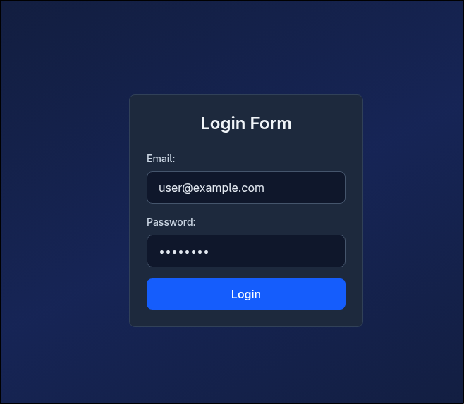
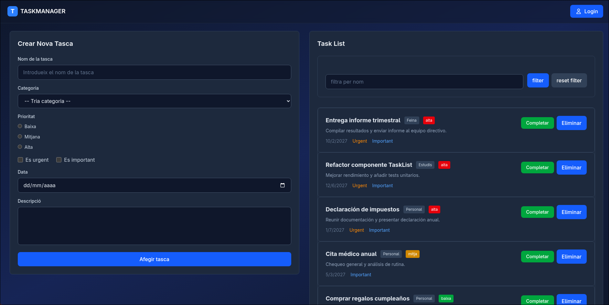
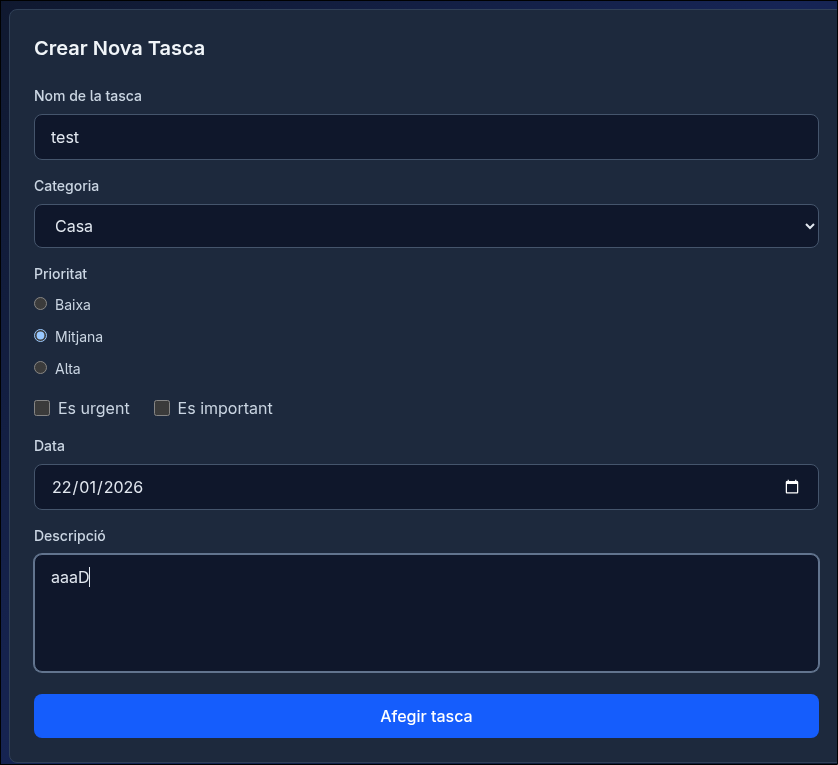
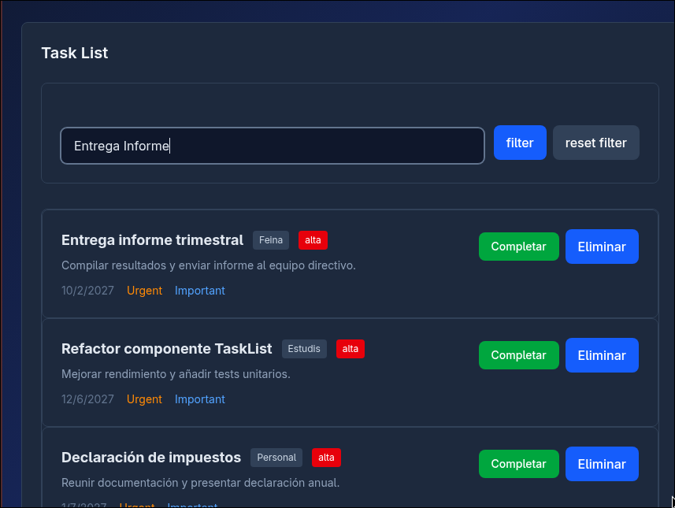
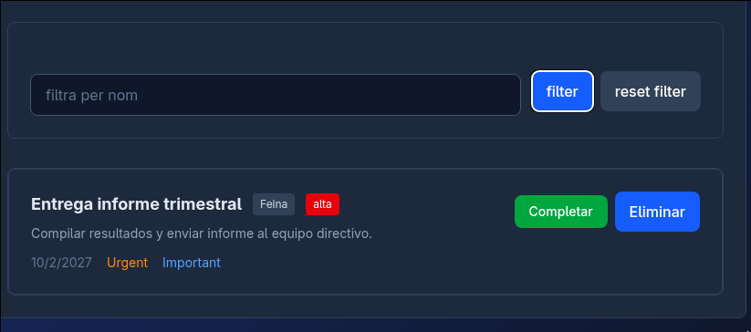
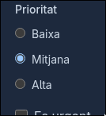
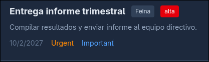
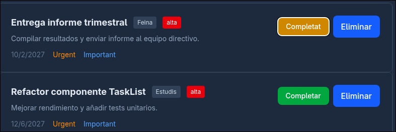

# react-tasklist

## Descripción general

react-tasklist es una aplicación de lista de tareas (task list) construida con React y Tailwind CSS. El proyecto sigue una arquitectura por características (feature-based) y promueve la reutilización mediante custom hooks para aislar la lógica de estado y efectos.

Objetivos
- Interfaz rápida y accesible para crear, editar, filtrar y ordenar tareas.
- Código organizado por features para facilitar escalado y mantenimiento.
- Uso de custom hooks para encapsular lógica reutilizable (estado, persistencia, formularios).
- Estilado con Tailwind CSS para consistencia y velocidad de desarrollo.

## Documentación

- [vite](./docs/vite.md) — Que es vite, el motor del proyecto. 
- [Arquitectura](./docs/architecture.md) — estructura por features y patrón de hooks.
- [React Hook Forms & zod](./docs/react-hooks-forms-zod.md) — Notas sobre RHF y Zod para entender el funcionamiento del
     proyecto.
- [Tailwind](./docs/tailwind.md) — Notas sobre tailwind y que es.
- [Instalación y Ejecución](./docs/setup.md) — cómo arrancar el proyecto localmente.

## Funcionamiento del programa y capturas

### Login
Primero haces login. Las credenciales están hardcodeadas dentro del formulario.

### Vista general
La aplicación muestra dos paneles principales: el formulario de creación a la izquierda y la lista de tareas a la derecha.

### Crear tareas
Puedes crear nuevas tareas rellenando el formulario. Incluye nombre, categoría, prioridad, fecha límite y descripción.

### Filtrar tareas
El buscador permite filtrar tareas por nombre, para resetear le das a reset filter .

### Gestionar tareas
Cada tarea muestra badges de categoría, prioridad y estado. Puedes completarlas o eliminarlas con los botones correspondientes.

### Marcar como urgente/importante
Las tareas se pueden marcar como urgentes, importantes al crearlas y se ordenan en base a la matriz de eisenhower.

### Completar tareas
Al completar una tarea, cambia su estado visualmente.

### Eliminar tareas
Puedes eliminar tareas permanentemente con el botón eliminar.

## Stack tecnológico

- React (v18+ recomendado)
- Tailwind CSS (v3+)
- Vite / Create React App (según la plantilla usada)
- Control de versiones: Git + GitHub
